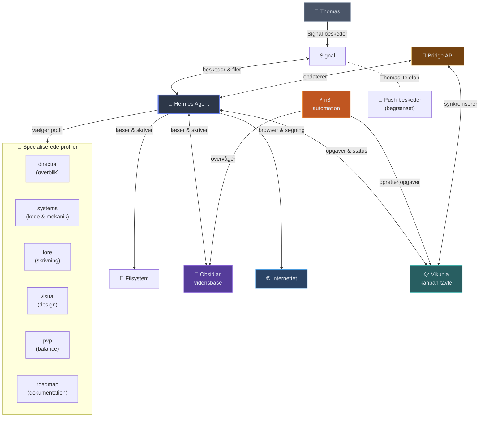

# AI Homelab

Dette repository dokumenterer et personligt AI-homelab bygget op omkring [Hermes Agent](https://hermes-agent.nousresearch.com/): en autonom AI-agent, der fordeler opgaver mellem specialiserede profiler, kobler til virkelige systemer via webhooks og kanban-tavler og kommunikerer over Signal. Projekterne her viser, hvad systemet kan — ikke som demoer, men som ting, der rent faktisk bliver brugt.

| Projekt | Hvad det viser |
|---|---|
| [Sentry](projects/sentry/) | Et selv-hostet investeringsdashboard med signalmotor, der oversætter 36 års AAII-regler til eksekverbar kode. Dataintegration (FRED, Yahoo, AAII), backtesting, signal-evaluering. |
| [Optik Job Pipeline](projects/optik-job-pipeline/) | En agent, der tager et stillingsopslag og producerer et målrettet CV og en ansøgning, og lærer af hver kørsel. Struktureret intake, dokumentgenerering, iterativ forbedring. |
| [Seniorer og SeniorKlar Audit](projects/seniorer-og-seniorklar-audit/) | En browserbaseret gennemgang af en reel organisations fem websites — brugervenlighed, navigation, tilgængelighed for et ældre publikum. Agenten som research-assistent, ikke som kodegenerator. |
| [Ultima Dawn](projects/ultima-dawn/) | Et personligt spildesignprojekt styret gennem domænespecialiserede agentprofiler og en orkestrator. Profil-per-kapacitet-routing, kanban-workflow, kreativt samarbejde. |

## Projekter

### Optik — Jobansøgningspipeline

Agentstyret pipeline, der tager et stillingsopslag og producerer et målrettet CV og en ansøgning. Den repetitive del — at matche erfaring, vælge variant, ramme tonen — håndteres af agenten. Mennesket beholder de strategiske beslutninger. Pipeline bygget iterativt: hver reel brug afslørede et hul, hvert hul blev låst fast i en skill.

Fem artefakter per kørsel: CV, ansøgning, stillingskontrakt, evidenskort og forbedringsefterslæb. Hvert trin er en isoleret skill — agenten kan forklare, ændre eller genkøre ethvert stadie.

### Seniorer og SeniorKlar Audit

En hurtig, struktureret gennemgang af fem offentlige websites for Faglige Seniorer — en medlemsorganisation med et ældre, mindre digitalt vant publikum. Pointen er metoden, ikke konklusionen: agenten besøgte hvert site side for side som en rigtig bruger, katalogiserede fund, krydsrefererede på tværs og prioriterede anbefalinger.

Dette var en første-gennemgang. En dybere audit ville inkludere analysedata, brugertests og stakeholder-interviews. Men som hurtig orientering — den type man måske leverer i sine første uger i en ny rolle — fanger den de mønstre, der betyder noget.

### Ultima Dawn — Spildesign-kompagnon

Et personligt kreativt spildesign bygget på ModernUO, der viser at agentsystemet er general-purpose. Samme infrastruktur, der håndterer jobansøgninger og site-audits, håndterer også serverkode, kampbalance, narrativ skrivning og visuelt design — gennem fem specialiserede profiler valgt automatisk efter opgavetype.

En orkestrator klassificerer indkommende opgaver og ruter til den rigtige profil. Når et væsen har brug for både mekanik og lore, arbejder to profiler på den samme opgave, og director-profilen forener resultaterne.

Under overfladen kører systemet på Proxmox (LXC) med Signal-beskeder, Vikunja-kanban, n8n-automation, et Obsidian-knowledge-vault og et custom bridge-API. [Arkitekturoversigten](architecture/stack-overview.md) giver det fulde billede.

---

## Hvad er alle de ting?

En kort introduktion til de værktøjer og begreber, systemet bruger — skrevet så man ikke behøver at være udvikler for at følge med.

**Hermes Agent**
En open source AI-agent — et program, der kan tænke, browse på nettet, læse og skrive filer, køre scripts og kommunikere over beskeder. Den kan skifte mellem forskellige AI-modeller alt efter hvad opgaven kræver. Tænk på den som en digital assistent, der rent faktisk kan gøre ting, ikke bare chatte.

**Signal**
En krypteret besked-app. Thomas kommunikerer med agenten over Signal — ligesom han ville skrive til et menneske. Agenten modtager beskeder, PDF'er og links, og svarer med tekst, filer og resultater.

**Kanban (Vikunja)**
En digital opslagstavle hvor opgaver flyttes mellem kolonner: Til triage → Klar → I gang → Blokeret → Færdig. Det giver overblik over hvad der arbejdes på, hvad der venter, og hvad der er færdigt. Vikunja er det specifikke værktøj systemet bruger — open source og selv-hostet.

**n8n**
En automationsmotor. Den lytter efter ændringer — for eksempel når en ny note dukker op i vidensbasen — og reagerer automatisk ved at sende opgaven videre til rette sted. Limen mellem systemets dele.

**Obsidian**
Et notesystem der fungerer som systemets fælles hukommelse. Både Thomas og agenten kan læse og skrive her. Projektnoter, arkitekturbeslutninger, referencer — alt hvad der er værd at huske på tværs af sessioner.

**Profiler**
Agentens specialiseringer. I stedet for én assistent har systemet otte — hver med sin egen styrke. Nogle er gode til at skrive (kimi-k2.6), andre til at analysere (deepseek-v4-pro), andre til at holde overblik (deepseek-v4-flash). Når en opgave kommer ind, vælger systemet automatisk den bedste profil til jobbet.

**Skills**
Agentens opskrifter. Hver gang systemet lærer en ny arbejdsgang — hvordan man bygger et CV, hvordan man reviewer et website, hvordan man konsoliderer to beslægtede vidensområder — bliver det gemt som en skill. Næste gang opgaven dukker op, ved agenten præcis hvad den skal gøre.

**Model routing**
Automatisk modelvalg. Systemet klassificerer hver opgave — er det skrivning? analyse? oversættelse? kode? — og vælger den AI-model der er bedst til præcis det. Brugeren mærker det ikke; det sker i baggrunden.

**Proxmox & LXC**
Den fysiske maskine og dens containere. Proxmox er virtualiseringssoftwaren der kører på en server hjemme hos Thomas. LXC-containere er letvægts virtuelle maskiner — én til agenten, én til n8n, én til Vikunja. Alt er selv-hostet.

---

## Sådan hænger det sammen

Lad os følge en konkret opgave gennem systemet. Thomas skriver over Signal: *"Skitsér lore-fundamentet for EarthDawn-udvidelsen — centrale fraktioner, zoner og den narrative krog."* Agenten modtager beskeden, klassificerer den — det her er skrivning og verdensopbygning — og sender den til **uodawn-lore**-profilen, som er fastlåst til en sprogmodel der er særligt god til kreativ skrivning (kimi-k2.6). Profilen producerer en struktureret fraktionsoversigt med narrative kroge og zonebeskrivelser, konsistent med resten af spilverdenen. Outputtet lander direkte på kanban-tavlen som en ticket-kommentar, så Thomas kan se det når han åbner Vikunja — eller få det leveret tilbage over Signal. Alt imens overvåger n8n vidensbasen for ændringer, så hvis nogen tilføjer nyt lore-materiale i Obsidian, opretter det automatisk en ny opgave til lore-profilen.
